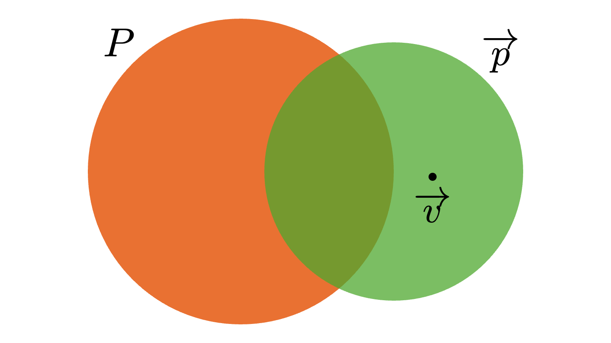
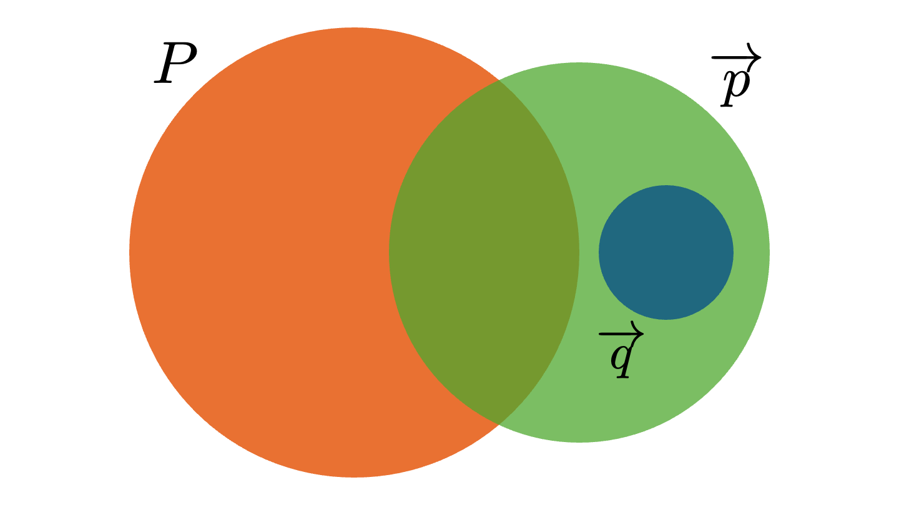

import Box from "../../../../components/Box.astro";

This post is Day 18 of [Proof Assistants Advent Calendar 2025](https://adventar.org/calendars/11438).

Since around last spring, I have been mechanizing a pattern-matching coverage-checking algorithm.
In this post, I will introduce the algorithm and my mechanization in Agda.[^1]

## Table of contents

## Background

Coverage checking for pattern matching is a static analysis that checks whether a match satisfies two nice properties: *exhaustiveness* and *non-redundancy*.

- Exhaustiveness: every value matches some pattern.
- Non-redundancy: there is no clause that execution can never reach.

Let's look at an example. In the following OCaml program, we implement a simple access-control function `allowed` using pattern matching.

```ocaml
type role = Staff | Manager | Admin
type action = View | Edit | Approve | Delete

let allowed role action =
  match role, action with
  | _,                 View    -> true
  | (Manager | Staff), Delete  -> false
  | manager,           Approve -> true
  | Staff,             Approve -> false
```

Is this pattern exhaustive? No. For example, there is no clause for the case `Staff, Edit`.
Evaluating `allowed Staff Edit` will raise a runtime exception.

What about non-redundancy? It also fails.
In the third clause, the first pattern is not the constructor pattern `Manager` but the variable pattern `manager`.
So `Staff, Approve` also matches the third clause, and the fourth clause is never reached.
When there is a redundant clause, it may indicate a mismatch between the programmer's intended case split and the code actually does.

As this example shows, coverage checking is an important analysis for improving program safety and predictability.

Many algorithms for coverage checking have been proposed.

- $\mathcal{U}_\mathrm{rec}$[^2]
  - the foundation of Rust's coverage-checking algorithm
  - was once implemented in the OCaml compiler
  - handles only a simple pattern language, but is still practical (most real programs use mostly simple patterns)
- Lower your guards[^3]
  - the foundation of Haskell's coverage-checking algorithm
  - supports more complex patterns (GADTs, view patterns, pattern synonyms, strictness, ...)
- ...

These algorithms often come with pen-and-paper correctness proofs, which is great!

But what about the **implementation**?
Even with a correct proof on paper, a buggy implementation can still produce wrong warnings or miss real bugs. Since coverage checking is important, it is natural to want a **verified coverage checker**.
After some digging (including verified compilers such as CakeML), I was not able to find many such implementations.[^4]
So I decided to formalize a coverage-checking algorithm and obtain a verified implementation in my favorite proof assistant, Agda.

I chose $\mathcal{U}_\mathrm{rec}$ as the target algorithm.
Because $\mathcal{U}_\mathrm{rec}$ is relatively simple, I expected it to be feasible to mechanize in a proof assistant.
It also seems like a good foundation for future work on mechanizing more complex and/or more efficient algorithms.

## An overview of $\mathcal{U}_\mathrm{rec}$

### The setting of $\mathcal{U}_\mathrm{rec}$

As mentioned above, $\mathcal{U}_\mathrm{rec}$ works over a fairly simple setting.
Concretely, we consider only algebraic data type values, and only three forms of patterns: wildcard patterns, constructor patterns, and or-patterns.
For coverage checking, we can treat variable patterns as wildcards.
We use $c$ for constructors, $u,v,w$ for values, and $p,q,r$ for patterns.

```math
\begin{array}{rcl}
u , v, w & \Coloneqq & c(v_1, \cdots, v_n) \\
p, q, r & \Coloneqq & \_ \\
  & | & c(p_1, \cdots, p_n) \\
  & | & (p \mid q) \\
\end{array}
```

We write value vectors $(v_1, \cdots, v_n)$ and pattern vectors $(p_1, \cdots, p_n)$ as $\overrightarrow{v}$ and $\overrightarrow{p}$, and a pattern matrix (a list of pattern vectors) as $P$.
Each row of the pattern matrix corresponds to a clause of a `match` expression.

We also introduce the binary relation $\preceq$ ("matches").[^8]
The match relation between a (single) value and a pattern is defined in the standard way:

```math
\begin{array}{rclcl}
  v & \preceq & \_ \\
  c(v_1, \cdots, v_n) & \preceq & c(p_1, \cdots, p_n) & \iff & (v_1, \cdots, v_n) \preceq (p_1, \cdots, p_n) \\
  v & \preceq & (p \mid q) & \iff & v \preceq p\ \ \text{or}\ \ v \preceq q
\end{array}
```

A value vector matches a pattern vector when all corresponding components match.
In particular, the empty value vector matches the empty pattern vector.

```math
(v_1, \cdots, v_n) \preceq (p_1, \cdots, p_n) \iff \forall\ i \in \{1, \cdots, n\},\ v_i \preceq p_i
```

Finally, we define the match relation between a value vector and a pattern matrix.

```math
\overrightarrow{v} \preceq P \iff \text{there exists a row } P_i \text{ in } P \text{ such that } \overrightarrow{v} \preceq P_i
```

Values and patterns are typed implicitly, and $\preceq$ is only defined when the value and the pattern have the same type.

Let's see an example. Consider the following list type:

```ocaml
type mylist = Nil | One of unit | Cons of unit * mylist
```

Now consider the following pattern matrices and value vectors:

```math
\begin{array}{c}
  P = \begin{pmatrix}
    \texttt{Nil} & \texttt{\_} \\
    \texttt{\_} & \texttt{Nil}
  \end{pmatrix}\quad
  Q = \begin{pmatrix}
    \texttt{Nil} & \texttt{\_} \\
    \texttt{\_} & \texttt{Nil} \\
    \texttt{One(\_)} & \texttt{\_} \\
    \texttt{\_} & \texttt{One(\_)} \\
    \texttt{Cons(\_, \_)} & \texttt{\_} \\
    \texttt{\_} & \texttt{Cons(\_, \_)}
  \end{pmatrix} \\ \\
  \overrightarrow{u} = \begin{pmatrix}
    \texttt{Nil} & \texttt{Nil}
  \end{pmatrix}\quad
  \overrightarrow{v} = \begin{pmatrix}
    \texttt{One(Nil)} & \texttt{Nil}
  \end{pmatrix}\quad
  \overrightarrow{w} = \begin{pmatrix}
    \texttt{One(Nil)} & \texttt{One(Nil)}
  \end{pmatrix}
\end{array}
```

In this situation, we have $\overrightarrow{u} \preceq P$ and $\overrightarrow{v} \preceq P$, because they match the first and second rows of $P$, respectively.
On the other hand, $\overrightarrow{w} \npreceq P$.
Also, we can see that $\overrightarrow{u}, \overrightarrow{v}, \overrightarrow{w} \preceq Q$.

### Pattern usefulness

$\mathcal{U}_\mathrm{rec}$ is not directly an algorithm for exhaustiveness or non-redundancy.
It checks a property called *usefulness*.
Usefulness is defined as follows:

<Box headerText="Definition (Usefulness)">
A pattern vector $\overrightarrow{p}$ is useful with respect to a pattern matrix $P$ (written $\mathcal{U}(P, \overrightarrow{p})$) if:
1. there exists a value vector $\overrightarrow{v}$ such that
2. $\overrightarrow{v}$ does not match any row of $P$ ($\overrightarrow{v} \npreceq P$), and
3. $\overrightarrow{v}$ matches $\overrightarrow{p}$ ($\overrightarrow{v} \preceq \overrightarrow{p}$).
</Box>

Continuing the earlier example, for $P$, the wildcard pattern vector $\overrightarrow{p} = (\texttt{\_}\ \ \texttt{\_})$ is useful.
A witness is $\overrightarrow{w} = (\texttt{One(Nil)}\ \ \texttt{One(Nil)})$, since $\overrightarrow{w} \npreceq P$ and $\overrightarrow{w} \preceq \overrightarrow{p}$.
Also, we can check that the 6th row of $Q$ is *not* useful with respect to the submatrix consisting of rows 1–5 of $Q$.

But, why do we care about usefulness?
It is because both exhaustiveness and non-redundancy can be rephrased in terms of usefulness.

<Box headerText="Lemmas">
1. $P$ is exhaustive $\iff$ the vector of wildcard patterns is *not* useful with respect to $P$ ( $\neg\ \mathcal{U}(P, (\_\ \cdots\ \_))$ )
2. the $i$-th clause of $P$ is non-redundant $\iff$ the $i$-th clause is useful with respect to the preceding clauses ( $\mathcal{U}(P_{[1,i)}, P_i)$ )
</Box>

The two usefulness examples above exactly showed that $P$ is not exhaustive and that the 6th clause of $Q$ is redundant.

Using these equivalences, we can implement exhaustiveness and redundancy checking algorithms on top of $\mathcal{U}_\mathrm{rec}$.

### How $\mathcal{U}_\mathrm{rec}$ works

Let's look at $\mathcal{U}_\mathrm{rec}$ in more detail.
Its specification is:

- Input: a pattern matrix $P$ and a pattern vector $\overrightarrow{p}$
- Output: a boolean
- Specification:
  - the types of the corresponding columns of $P$ and $\overrightarrow{p}$ must agree
  - it returns true iff $\overrightarrow{p}$ is useful with respect to $P$ ( $\mathcal{U}_\mathrm{rec}(P, \overrightarrow{p}) = \mathrm{True} \iff \mathcal{U}(P, \overrightarrow{p})$ )

Operationally, $\mathcal{U}_\mathrm{rec}$ searches for a witness value vector for usefulness.
It case-splits on the structure of $\overrightarrow{p}$ and narrows down what the structure of the witness could be.
At the same time, it shrinks the problem by discarding rows of $P$ that the witness does not definitively match.
Then it recursively solves the smaller subproblem.

#### When $\overrightarrow{p}$ is empty

This is the base case of the recursion, and it solves the simplest usefulness problem.
Here, $P$ is a 0-column pattern matrix (a matrix whose rows are empty pattern vectors).
Recalling that the empty value vector matches the empty pattern vector,
we just need to return whether $P$ has no rows (i.e. whether it is the empty matrix).
If $P$ has no rows, the empty value vector is a witness for usefulness.
If $P$ has at least one row, then $() \preceq P$ and $\overrightarrow{p}$ is not useful.

```math
\mathcal{U}_\mathrm{rec}(P, \begin{pmatrix} \end{pmatrix}) = \begin{cases}
   \mathrm{True} & \text{if } P \text{ has no rows} \\
   \mathrm{False} & \text{otherwise}
\end{cases}
```

#### When the head of $\overrightarrow{p}$ is an or-pattern

We recursively solve the cases where we choose the left or the right side, and take the disjunction.

```math
\begin{align*}
&\mathcal{U}_\mathrm{rec}(
  P,
  \begin{pmatrix} (p_l \mid p_r) & p_2 & \cdots & p_n \end{pmatrix}
) = \\
&\quad\quad \mathcal{U}_\mathrm{rec}(
  P,
  \begin{pmatrix} p_l & p_2 & \cdots & p_n \end{pmatrix}
) \lor
\mathcal{U}_\mathrm{rec}(
  P,
  \begin{pmatrix} p_r & p_2 & \cdots & p_n \end{pmatrix}
)
\end{align*}
```

#### When the head of $\overrightarrow{p}$ is a constructor pattern

If the head of $\overrightarrow{p}$ is $c(r_1, \cdots, r_m)$, then any witness value vector $\overrightarrow{v}$ must also start with a value of the form $c(v_1, \cdots, v_m)$.
Therefore, we can discard rows of $P$ whose head pattern is $c'(\ \cdots)$ with $c' \neq c$.
Let $\mathcal{S}$ be this filtering operation (called *specialization*).
Then $\mathcal{U}_\mathrm{rec}$ is defined as follows.
Nested patterns inside the constructor pattern are pulled out and prepended to the pattern vector:

```math
\begin{align*}
&\mathcal{U}_\mathrm{rec}(
  P,
  \begin{pmatrix} c(r_1, \cdots, r_m) & p_2 & \cdots & p_n \end{pmatrix}
) = \\
&\quad\quad \mathcal{U}_\mathrm{rec}(
  \mathcal{S}(c, P),
  \begin{pmatrix} r_1 & \cdots & r_m & p_2 & \cdots & p_n \end{pmatrix}
)
\end{align*}
```

The definition of $\mathcal{S}$ is the following.
It expands or-patterns into two rows and expands wildcard patterns into as many wildcards as the arity of the constructor.

```math
\begin{array}{c}
\mathcal{S}(c, \begin{pmatrix}
\end{pmatrix}) = \begin{pmatrix}
\end{pmatrix} \\
\mathcal{S}\left(c, \left(\begin{array}{c}
  \begin{matrix} (p_l \mid p_r) & p_2 & \cdots & p_n \end{matrix} \\
  P
\end{array}\right)\right) =
\mathcal{S}\left(c, \begin{pmatrix}
    \begin{matrix} p_l & p_2 & \cdots & p_n \end{matrix} \\
    \begin{matrix} p_r & p_2 & \cdots & p_n \end{matrix} \\
    P
  \end{pmatrix}
\right) \\
\mathcal{S}\left(c, \left(\begin{array}{c}
  \begin{matrix} c'(r_1, \cdots, r_m) & p_2 & \cdots & p_n \end{matrix} \\
  P
\end{array}\right)\right) = \begin{cases}
  \begin{pmatrix}
    \begin{matrix} r_1 & \cdots & r_m & p_2 & \cdots & p_n \end{matrix} \\
    \mathcal{S}(c, P)
  \end{pmatrix} & \text{if } c = c' \\
  \mathcal{S}(c, P) & \text{otherwise}
  \end{cases} \\
\mathcal{S}\left(c, \left(\begin{array}{c}
  \begin{matrix} \_ & p_2 & \cdots & p_n \end{matrix} \\
  P
\end{array}\right)\right) =
  \begin{pmatrix}
    \begin{matrix} \_ & \cdots & \_ & p_2 & \cdots & p_n \end{matrix} \\
    \mathcal{S}(c, P)
  \end{pmatrix}
\end{array}
```

#### When the head of $\overrightarrow{p}$ is a wildcard

Unlike the constructor case, the wildcard pattern does not determine the shape of the first value of the witness value vector.
So in principle we need a brute-force approach, specializing by every possible constructor and taking the disjunction.

```math
\begin{align*}
&\mathcal{U}_\mathrm{rec}(
  P,
  \begin{pmatrix} \_ & p_2 & \cdots & p_n \end{pmatrix}
) = \\
&\quad\quad \bigvee_{c_k : \text{ Constructor}} \mathcal{U}_\mathrm{rec}(
  \mathcal{S}(c_k, P),
  \begin{pmatrix} \_ & \cdots & \_ & p_2 & \cdots & p_n \end{pmatrix}
)
\end{align*}
```

However, we can sometimes avoid brute force using information from $P$.
Consider the following $P$ and $\overrightarrow{p}$:

```math
\begin{align*}
P = \begin{pmatrix}
   \texttt{Nil} & \texttt{\_} \\
   \texttt{One(\_)} & \texttt{\_} \\
   \texttt{\_} & \texttt{Nil} \\
   \texttt{\_} & \texttt{One(\_)}
\end{pmatrix} &&
\overrightarrow{p} = \begin{pmatrix} \_ & \texttt{Cons(\_,\_)} \end{pmatrix}
\end{align*}
```

Looking at the first column of $P$, among the constructors of `mylist`, we see `Nil` and `One`, but not `Cons`.
Now suppose the witness value vector starts with the value of the form `Cons(...)`.
Then it can only match rows whose first pattern is a wildcard (rows 3 and 4), so we can focus only on those rows:

```math
\begin{align*}
P = \begin{pmatrix}
   \texttt{\_} & \texttt{Nil} \\
   \texttt{\_} & \texttt{One(\_)}
\end{pmatrix} &&
\overrightarrow{p} = \begin{pmatrix} \_ & \texttt{Cons(\_,\_)} \end{pmatrix}
\end{align*}
```

Now the first column of both $P$ and $\overrightarrow{p}$ is entirely wildcards.
Since that column carries no information, usefulness is determined only by the second column, so we obtain the following smaller problem:

```math
\begin{align*}
P = \begin{pmatrix}
   \texttt{Nil} \\
   \texttt{One(\_)}
\end{pmatrix} &&
\overrightarrow{p} = \begin{pmatrix} \texttt{Cons(\_,\_)} \end{pmatrix}
\end{align*}
```

In this way, if there exists a missing constructor $c$ in the first column of $P$, we can pick a witness starting with $c(\text{\footnotesize{some appropriate value vector}})$ and shrink the problem efficiently without brute force.[^9]

Putting this together, when the head of $\overrightarrow{p}$ is a wildcard, $\mathcal{U}_\mathrm{rec}$ is defined as:

```math
\begin{align*}
&\mathcal{U}_\mathrm{rec}(
  P,
  \begin{pmatrix} \_ & p_2 & \cdots & p_n \end{pmatrix}
) = \\
&\quad\quad \begin{cases}
\mathcal{U}_\mathrm{rec}(
  \mathcal{D}(P),
  \begin{pmatrix} p_2 & \cdots & p_n \end{pmatrix}
) & \text{if there is a missing constructor in } \Sigma \\
\bigvee_{c_k} \mathcal{U}_\mathrm{rec}(
  \mathcal{S}(c_k, P),
  \begin{pmatrix} \_ & \cdots & \_ & p_2 & \cdots & p_n \end{pmatrix}
) & \text{otherwise}
\end{cases}
\end{align*}
```

Here, $\Sigma$ is the set of constructors that appear in the first column of $P$.
$\mathcal{D}$ extracts only the suffixes (columns 2..n) of rows whose head is a wildcard, and is defined as follows.
As with $\mathcal{S}$, if the head is an or-pattern, we expand it into two rows:

```math
\begin{array}{c}
\mathcal{D}(\begin{pmatrix}
\end{pmatrix}) = \begin{pmatrix}
\end{pmatrix} \\
\mathcal{D}\left(\left(\begin{array}{c}
  \begin{matrix} (p_l \mid p_r) & p_2 & \cdots & p_n \end{matrix} \\
  P
\end{array}\right)\right) =
\mathcal{D}\left(\begin{pmatrix}
    \begin{matrix} p_l & p_2 & \cdots & p_n \end{matrix} \\
    \begin{matrix} p_r & p_2 & \cdots & p_n \end{matrix} \\
    P
  \end{pmatrix}
\right) \\
\mathcal{D}\left(\left(\begin{array}{c}
  \begin{matrix} c(r_1, \cdots, r_m) & p_2 & \cdots & p_n \end{matrix} \\
  P
\end{array}\right)\right) =
\mathcal{D}(P) \\
\mathcal{D}\left(\left(\begin{array}{c}
  \begin{matrix} \_ & p_2 & \cdots & p_n \end{matrix} \\
  P
\end{array}\right)\right) =
  \begin{pmatrix}
    \begin{matrix} p_2 & \cdots & p_n \end{matrix} \\
    \mathcal{D}(P)
  \end{pmatrix}
\end{array}
```

That's the basic idea behind how $\mathcal{U}_\mathrm{rec}$ works.

## Highlights of the mechanization

Now let's finally look at the mechanization.
That said, most of what I did is simply translating the operational idea above into Agda, so here I will only highlight a few key parts.

### Correctness proof

This is the main part of the mechanization.
In this project, I proved correctness by implementing an **evidence-producing** version of $\mathcal{U}_\mathrm{rec}$.
The original $\mathcal{U}_\mathrm{rec}$ returns only a boolean, but my implementation explicitly computes and returns evidence for usefulness.

Here is the pseudocode.
The type `Useful` is a record type that encodes the definition of usefulness in Agda.
It contains a `witness`, and proofs that it really is a witness.
The function `decUseful` implements $\mathcal{U}_\mathrm{rec}$.
Its return type is `Dec (Useful P ps)`, so if `ps` is useful with respect to `P` it returns the evidence. Otherwise, it returns a proof that no evidence exists.

```agda
record Useful (P : PatternMatrix) (ps : Patterns) : Type where
  field
    witness : Values
    witness-does-not-match-P : witness ⋠ P
    witness-matches-ps : witness ≼ ps

data Dec (A : Type) : Type where
  Yes : A → Dec A
  No : ¬ A → Dec A

decUseful : (P : PatternMatrix) (ps : Pattern) → Dec (Useful P ps)
```

With this approach, implementation and correctness proof come together, and we get a correct-by-construction implementation.
Moreover, the witness returned by `decUseful` is useful for improving error messages. It can be used to display a concrete example of what is not covered.

### Extending usefulness

I just said the witness can be used for error messages.
But if we think about real compilers, they typically display **an uncovered pattern**, not **an uncovered value**.

For example, consider the following OCaml program:

```ocaml
let foo (xs : mylist) (ys : mylist) : string =
  match xs, ys with
  | Nil, _   -> "nil-wildcard"
  | _  , Nil -> "wildcard-nil"
```

The OCaml compiler reports:

```text
Warning 8: this pattern-matching is not exhaustive.
Here is an example of a case that is not matched:
((One _|Cons (_, _)), (One _|Cons (_, _)))
```

It is great that it shows patterns rather than values, because it is more informative.
So I would like `decUseful` to return a witness pattern vector (or a non-empty set of them), and for that we need to extend both the definition of usefulness and the algorithm.

How should we extend the definition?
Recall the original definition of usefulness.
In the picture below, we can think of $P$ and $\overrightarrow{p}$ as describing sets of value vectors, and a witness $\overrightarrow{v}$ as a point in the set difference $\overrightarrow{p} \setminus P$.



In the extended definition, we want witnesses to be *pattern vectors*.
So we should "inflate" a witness from a point to a set, like $\overrightarrow{q}$ in the picture.
In other words, we extend a witness to be a subset of the set difference.



Formalizing this intuition:

<Box headerText="Definition (Extended Usefulness)">
A pattern vector $\overrightarrow{p}$ is useful (in the extended sense) with respect to a pattern matrix $P$ if:
1. there exists a pattern vector $\overrightarrow{q}$ such that
2. $\overrightarrow{q}$ is disjoint from $P$ ($\forall \overrightarrow{v},\ \overrightarrow{v} \preceq \overrightarrow{q} \implies \overrightarrow{v} \npreceq P$)
3. $\overrightarrow{q}$ is subsumed by $\overrightarrow{p}$ ($\forall \overrightarrow{v},\ \overrightarrow{v} \preceq \overrightarrow{q} \implies \overrightarrow{v} \preceq \overrightarrow{p}$)
</Box>

"Is disjoint from" instead of "does not match", and "is subsumed by" instead of "matches".

What should the algorithm look like for the extended definition?
It does not need big changes.
Roughly speaking, the only places we need to change are where the original algorithm took disjunctions (or-patterns, and brute-force splitting for wildcards) in case you want compute all the witnesses.
Instead of taking a disjunction, we take a union and return *all* witnesses.

The pseudocode looks like this.
Besides the extended `Useful`, the return type of `decUseful` is now `Dec (NonEmpty (Useful P ps))`, so it returns a non-empty list of witnesses.

```agda
record Useful (P : PatternMatrix) (ps : Patterns) : Type where
  field
    witness : Patterns
    witness-disjoint-from-P : ∀ {vs} → vs ≼ witness → vs ≼ P → ⊥
    ps-subsumes-witness : ∀ {vs} → vs ≼ witness → vs ≼ ps

decUseful : (P : PatternMatrix) (ps : Pattern) → Dec (NonEmpty (Useful P ps))
```

I have not proved completeness of the witnesses returned by `decUseful` yet (i.e. that they fully cover $\overrightarrow{p} \setminus P$), so that is still future work.

### Termination proof

Termination matters too because we do not want the compiler to loop forever in coverage checking.
However, the original paper does not contain a termination proof for $\mathcal{U}_\mathrm{rec}$.

Proving termination for $\mathcal{U}_\mathrm{rec}$ is tricky, because (as we saw above) it has a complex recursion structure.
It is not structural recursion, so we will need well-founded recursion
However, finding a good measure is the hard part.
The following aspects are particularly problematic:

1. $\mathcal{S}$ and $\mathcal{D}$ expand or-patterns.
2. $\mathcal{S}$ can expand a wildcard into multiple wildcards.

Because of these, a naive pattern size measure does not necessarily decrease, and it can even increase.
Luckily, I managed to find a suitable measure using roughly the following idea:

1. count pattern size *after fully expanding or-patterns*[^5]
2. do not count wildcards
3. since (2) can break strict decrease in some cases, combine another decreasing measure (such as the number of columns of the pattern matrix) in a lexicographic order

### Compiling to Haskell with agda2hs

Since the goal is a verified *implementation* of a coverage checker, I want to make the Agda code runnable.
For that, I used [agda2hs](https://github.com/agda/agda2hs).
agda2hs translates a subset of Agda into Haskell while aiming to stay close to the original code (and to generate human-readable Haskell), unlike Agda's built-in Haskell backend.

With agda2hs, we specify which parts of the Agda code should be erased in Haskell using the [erasure](https://agda.readthedocs.io/en/latest/language/runtime-irrelevance.html) feature.
Parts annotated with `@0` (or `@erased`) in Agda code are erased in the generated Haskell code.
For example, suppose we annotate the `Useful` type as follows.
`witness-disjoint-from-P` and `ps-subsumes-witness` are proof-only information, so we want to erase them.
```agda
record Useful (@0 P : PatternMatrix) (@0 ps : Patterns) : Type where
  field
    witness : Patterns
    @0 witness-disjoint-from-P : ∀ {vs} → vs ≼ witness → vs ≼ P → ⊥
    @0 ps-subsumes-witness : ∀ {vs} → vs ≼ witness → vs ≼ ps
```

After running agda2hs, we get Haskell code like this, which is what we want.

```haskell
newtype Useful = Useful { witness :: Patterns }
```

By going through the whole mechanization and carefully adding `@0` where appropriate, we can obtain code that is not so different from a direct Haskell implementation!

## Conclusion

In this post, I talked about implementing a verified coverage checker in Agda.

Going forward, I would like to build on this mechanization and formalize more complex and/or more efficient algorithms.
As a first step, I would like to formalize an optimized variant used in Rust that checks exhaustiveness and per-clause redundancy in one go.[^6]

I have published the full mechanization on [GitHub](https://github.com/wasabi315/coverage-checking). The [haskell branch](https://github.com/wasabi315/coverage-checking/tree/haskell/lib/CoverageCheck) also contains the Haskell code generated by agda2hs.
I also host an HTML-rendered version of the code on GitHub Pages, so check it out if you are interested!

https://wasabi315.github.io/coverage-checking

[^1]: I planned to write this for [last year's Advent Calendar](https://adventar.org/calendars/10209), but I got stuck on the termination proof, so it ended up being this year. I also wrote a paper about this mechanization, which is going to be published later. The preprint is available [here](https://wasabi315.github.io/files/wctp2025a.pdf).
[^2]: [Luc Maranget, Warnings for Pattern Matching](https://doi.org/10.1017/S0956796807006223). This paper proposes several algorithms and $\mathcal{U}_\mathrm{rec}$ is the most basic one among them.
[^3]: [Sebastian Graf, Simon Peyton Jones, and Ryan G. Scott, Lower your guards](https://doi.org/10.1145/3408989)
[^4]: As far as I could find, besides the concurrent work [Joshua M. Cohen, A Mechanized First-Order Theory of Algebraic Data Types with Pattern Matching](https://doi.org/10.4230/LIPIcs.ITP.2025.5), I was not able to find much. That paper similarly claims that there was little prior work.
[^5]: In practice, we also include the number of or-patterns in the size: if we only count size *after* expanding them, then the or-pattern step would no longer decrease the measure.
[^6]: Currently, we have to run exhaustiveness checking and (separately) redundancy checking for each clause, which means calling $\mathcal{U}_\mathrm{rec}$ a number of times proportional to the number of clauses.
[^8]: I reverse the operand order compared to the original paper. This order feels more readable to me because it resembles set membership $\in$.
[^9]: If the types of constructor arguments include an empty type (Haskell's `Void`), then "some appropriate value vector" may not exist. So $\mathcal{U}_\mathrm{rec}$ assumes that every type is inhabited.
