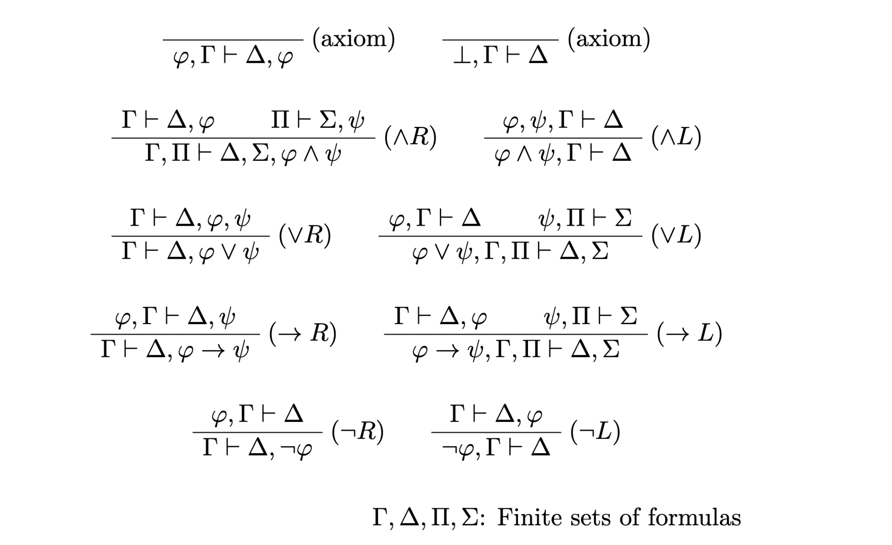

LkProver converts LK sequents into `bussproofs` commands.

<https://github.com/wasabi315/LkProver>

## Contents

## Usage

[Dune](https://dune.build/) is required to run this tool.

```ansi
dune exec bin/main.exe '|- ((p -> q) -> p) -> p'
```

The above command will output the following LaTeX snippet:

```latex
\begin{prooftree}
\AxiomC{}
\RightLabel{(axiom)}
\UnaryInfC{$p \vdash p, q$}
\RightLabel{($\rightarrow R$)}
\UnaryInfC{$\vdash p, p \rightarrow q$}
\AxiomC{}
\RightLabel{(axiom)}
\UnaryInfC{$p \vdash p$}
\RightLabel{($\rightarrow L$)}
\BinaryInfC{$(p \rightarrow q) \rightarrow p \vdash p$}
\RightLabel{($\rightarrow R$)}
\UnaryInfC{$\vdash ((p \rightarrow q) \rightarrow p) \rightarrow p$}
\end{prooftree}
```

## Input format

Here is the input syntax of LkProver. The precedence of connectives follows the usual one.

```bnf
<sequent> ::= <expr> "⊢" <expr>
            | <expr> "|-" <expr>
            | <expr> "⇒" <expr>
            | <expr> "=>" <expr>
<expr>    ::= <var>
            | "⊥" | "_|_"
            | "¬" <expr> | "~" <expr> | "!" <expr>
            | <expr> "∧" <expr> | <expr> "/\" <expr> | <expr> "^" <expr> | <expr> "&" <expr>
            | <expr> "∨" <expr> | <expr> "\/" <expr> | <expr> "|" <expr>
            | <expr> "→" <expr> | <expr> "->" <expr>
            | "(" <expr> ")"
<var>     ::= [A-Za-z][A-Za-z0-9_]*
```

## Inference Rules

LkProver adopts the following inference rules (what I learned in a logic lecture):


## Implementaion

LkProver is implemented in OCaml. The implementation is very straightforward, just following the inference rules above.

I used [Menhir](http://cambium.inria.fr/~fpottier/menhir/) and [sedlex](https://github.com/ocaml-community/sedlex) for parsing and lexing input sequents.
My experience with sedlex was great because lexer specifications are embedded in regular OCaml source codes, so we can still get the help of OCaml Language Server, unlike Menhir which is written in separate `.mly` files.

---

If you are interested, please check out the [repository](https://github.com/wasabi315/LkProver).
