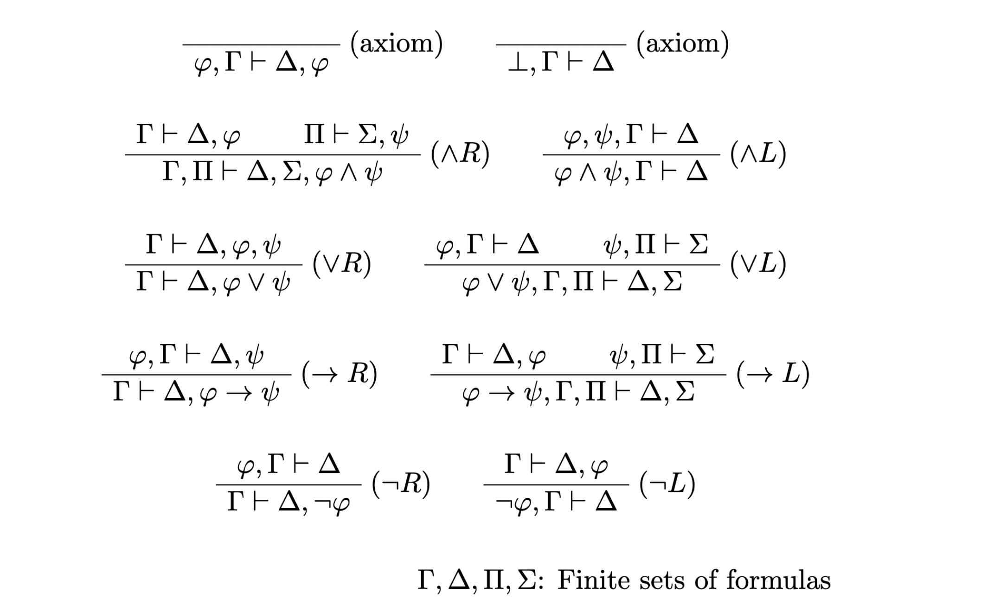

LkProver converts LK sequents into proofs written in the format of LaTeX's `bussproofs` package.

## Usage

Dune[^1] is required to run this tool.

```bash
git clone https://github.com/wasabi315/LkProver.git && cd LkProver
echo '|- ((p -> q) -> p) -> p' | dune exec bin/main.exe
```

The above command will output the following LaTeX snippet:

```latex
\begin{prooftree}
\AxiomC{}
\RightLabel{(axiom)}
\UnaryInfC{$p \vdash p, q$}
\RightLabel{($\rightarrow R$)}
\UnaryInfC{$\vdash p, p \rightarrow q$}
\AxiomC{}
\RightLabel{(axiom)}
\UnaryInfC{$p \vdash p$}
\RightLabel{($\rightarrow L$)}
\BinaryInfC{$(p \rightarrow q) \rightarrow p \vdash p$}
\RightLabel{($\rightarrow R$)}
\UnaryInfC{$\vdash ((p \rightarrow q) \rightarrow p) \rightarrow p$}
\end{prooftree}
```

## Available Symbols
You can use the following symbols in the input sequent:
- variables : `[A-Za-z][A-Za-z0-9_]*`
- bottom: `⊥` (U+22A5), `_|_`
- not : `¬` (U+00AC), `~`, `!`
- and : `∧` (U+2227), `/\`, `^`, `&`
- or : `∨` (U+2228), `\/`, `|`
- implication : `→` (U+2192), `->`
- proves : `⇒` (U+21D2), `=>`, `⊢` (U+22A2), `|-`
- parentheses : `(`, `)`

## Inference Rules
LkProver adopts the following inference rules:

